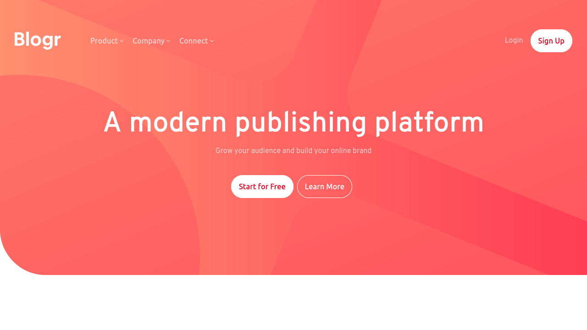
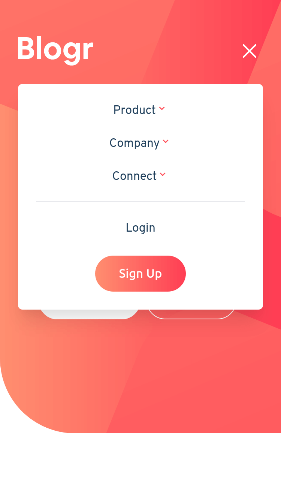
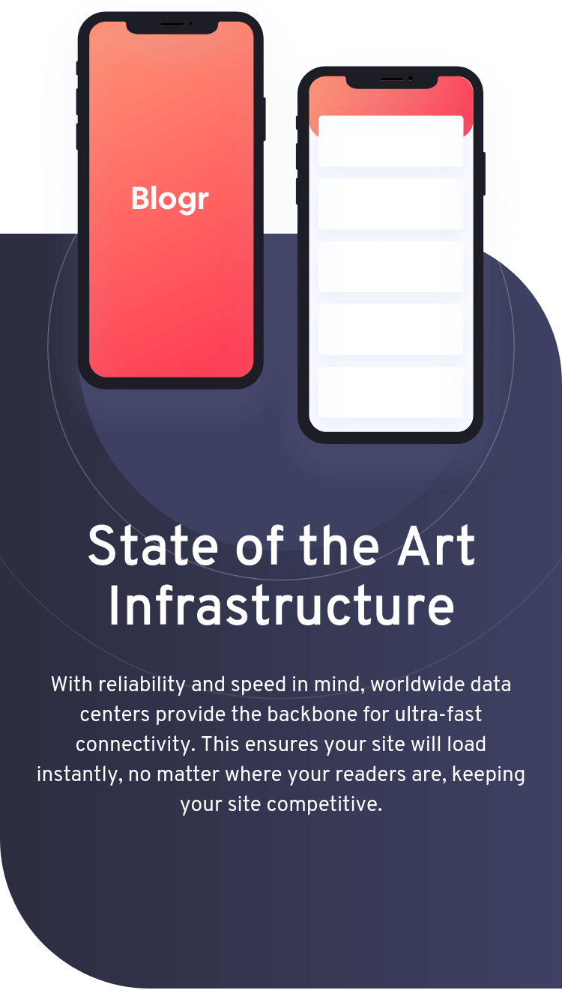

# Blogr - Demo Landing Page

This is a demo landing page for a fictional blogging platform, Blogr.

  
Table of Contents

  <ol>
    <li><a href="#description">Description</a></li>
    <li><a href="#live-demo">Live Demo</a></li>
    <li><a href="#built-with">Built With</a></li>
    <li><a href="#acknowledgements">Acknowledgments</a></li>
  </ol>

## Description

I built this project as part of FrontEnd Mentor's front-end challenges. The site is a demo landing page for a fictitious blogging platform company, Blogr.

 

The site features a fully mobile responsive design, and interactive UI components.

  
  

 

## Live Demo

Preview the live demo: [https://jonrutter-blogr-landing-page.netlify.app/](https://jonrutter-blogr-landing-page.netlify.app/)

## Built with

- [Gatsby](https://www.gatsbyjs.com/)
- [TailwindCSS](https://tailwindcss.com/)

## Acknowledgements

- Credit to [FrontEnd Mentor](https://www.frontendmentor.io/) for creating the [site's design](https://www.frontendmentor.io/challenges/blogr-landing-page-EX2RLAApP) and making it available as a free front-end challenge.
